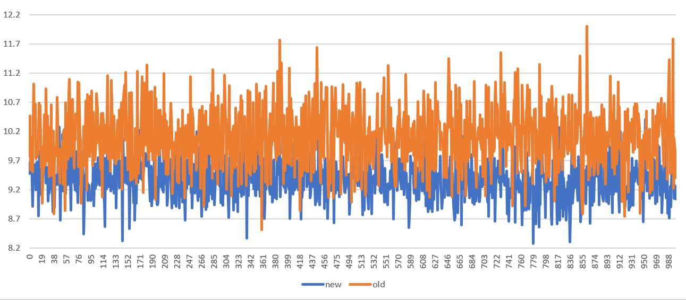
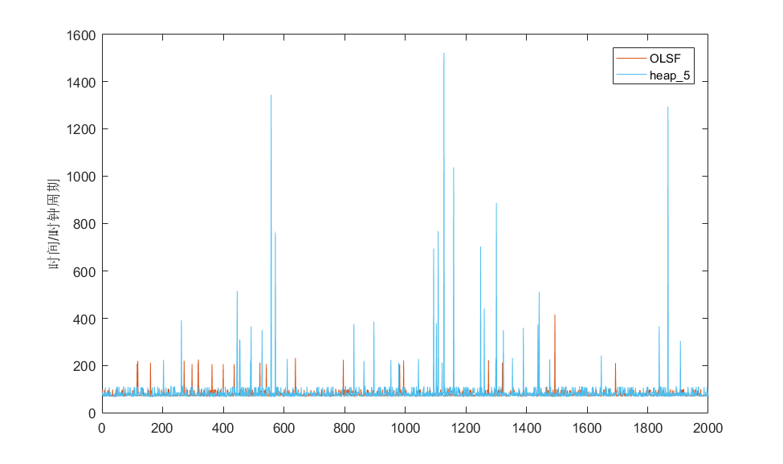

# 结题报告
我们的项目工作是对 Amazon-FreeRTOS 的优化. 包括使用新算法实现内存管理机制达到节省时间的目的, 以及使用协程来完成任务调度, 达到减少时间的消耗以及节省内存开销的目的.
## 完成代码
[优化内存调度算法](https://github.com/OSH-2018/X-Optimization-of-Amazon-FreeRTOS/tree/master/mem-management)<br>
[基于协程的任务调度优化](https://github.com/OSH-2018/X-Optimization-of-Amazon-FreeRTOS/tree/master/coroutine)<br>

## 如何使用我们编写的代码
我们总共编写了heap_6.c和coroutine.c两个文件，如果要使用还需要在某些头文件内做一些宏定义进行修改以符合各种参数，以及将这两个文件包含进来，使用方法参见 [heap_6.c和coroutine.c使用方法](https://github.com/OSH-2018/X-Optimization-of-Amazon-FreeRTOS/blob/master/report-final/how%20to%20use.md) <br>
## 内存管理
### FreeRTOS内存管理现状分析
在FreeRTOS中，内存管理使用pvPortMalloc与vPortFree函数，函数原型如下：
```c
void *pvPortMalloc(size_txWantedSize);
void vPortFree(void*pv);
```
pvPortMalloc函数类似于c语言中的malloc函数，形参是调用者请求的内存大小，类型size_t是unsignedint的重定义。返回值为一个void型指针，指向申请到的起始地址。
vPortFree函数类似于c语言中的free函数，释放掉由pv指向的一段空间。

在FreeRTOSv10.0.1中有5中内存管理策略，分别被命名为heap_1，heap_2，heap_3，heap_4，heap_5。

* heap_1
将所有内存看作一个数组。类型为unsignedchar，也就是一个字节，数组大小为内存堆总大小。
第一次调用pvPortMalloc时，heap_1首先确定全部堆空间的起始地址，用pucAlignedHeap保存。
如果调用者申请大小为xWantedSize的空间，heap_1在判断是否有足够的空间分配之后，直接返回下一个空闲字节的地址，同时把下一个空闲字节地址加上本次分配的空间大小。
由于heap_1策略没有记录每次分配的起始地址及大小，vPortFree函数只能把传入的指针清零，并没有实际释放空间。

* heap_2
heap_2使用一个链表FreeList记录内存中所有的空闲空间。
当调用者申请大小为xWantedSize的空间时，heap_2检索整个链表，寻找一个空闲空间大于等于xWantedSize的空间。如果该空间大于xWantedSize，heap_2会将该空间分为两块，并将未使用的部分放入FreeList。FreeList中的地址空间按从小到大排列，保证每次调用时所需的时间最短。
heap_2的vPortFree函数把传入指针重新加入FreeList，完成空间释放。
heap_2可以释放空间，但不能把已经释放的连续空间重新整合成一个大空间，因此大量的申请、释放随机大小的空间会导致大量的碎片。因此heap_2适合动态申请、删除相等空间的应用。heap_2申请空间的时间不确定，但仍然比系统提供的malloc与free效率高。

* heap_3
heap_3简单的调用了c语言的malloc与free函数，对于嵌入式操作系统来说有可能无法使用，也有可能占用宝贵的代码空间。heap_3会在调用malloc和free之前挂起调度器，保证线程安全。由于heap_3的内存堆由链接器控制，不做重点分析。

* heap_4
heap_4是heap_2的改进版本，在heap_2的基础上把释放出的连续空间重新整合成一个大的空间并加入FreeList。
heap_4相比于heap_2在随机大小的申请释放过程中产生的碎片更少，但由于仍然需要遍历链表申请时间仍然不确定。

* heap_5
heap_5是heap_4的改进版本，同样可以重新整合空间。在此基础上，heap_5可以给与调用者多块非连续的空间。heap_5的FreeList不再按空间大小排序，而是按照未分配内存的地址从低到高排序。分配时根据需求大小从低地址到高地址从FreeList中依次取出空间并用指针连接起来返回。
heap_5的vPortFree函数的实现和heap_4的类似，同样需要把要释放的空间和它在物理上相连的未分配空间整合后放入FreeList。
由于heap_5需要花费额外空间来连接不相邻空间，对于某些小内存设备来说是一种浪费，并且加大了内存使用者的负担。在时间上heap_5虽然能做到比heap_4更快，仍然到不了O(1)量级。
综合上述5种已有的内存调度策略，对于时间确定（即时间复杂度为O(1)）的算法(heap_1)，无法释放空间，而其余可以释放空间的算法申请空间时都需要遍历链表，无法做到O(1)时间。在最新的FreeRTOSv10.0.1中默认采用heap_5。

### FreeRTOS内存管理改进目标
由于FreeRTOS通常用于较小内存的系统，本研究中将FreeRTOS的工作内存设定为64K。同时为了应对更加严苛的实时性要求，在舍弃尽量少空间的基础上做到O(1)时间复杂度的分配、释放内存操作。另外由于内存较小，改进算法减少碎片。
考虑到本研究针对的环境为小内存环境，工作应比较简单且重复性较高，内存请求不会过大且释放比较规律，恶意的请求可以尽量通过修改程序避免，应着重考虑时间效率，其次应尽量给与用户程序更大的空间，最后碎片尽量不要过小以致不能使用即可。

### 一种针对RTOS的新算法——TLSF
#### 概述
TLSF(Two-Level Segregated Fit)是一种二级分隔拟合算法，由Masmano等人在2004年提出，它使用链表与位图相结合的方式对内存进行管理。采用空链表数组，并将数组设计为二级数组：第一级数组按照2的幂将空内存块分级，分级的数目称为第一级。第二级数组将第一级的结果进一步线性划分。每一个链表数组都有一个相关联的位图来记录内存块的使用情况及空内存块的大小和位置。
TLSF 算法通过单链表管理从物理内存获取的不连续的内存区域。当用户申请指定大小内存时，TLSF算法首先在当前已有的内存区域中查找是否有满足要求的内存块。与传统算法不同的是，TLSF算法可以通过公式1直接计算出指定大小内存在单链表中的位置。如果链表中有满足要求的内存则返回给用户，没有则从物理内存新申请一块固定大小的内存区域，并从其中分配出指定大小内存块给用户，同时将该内存区域中剩下的空闲块添加到二级索引中。与此同时，TLSF算法尝试合并新分配的内存区域到已有内存区域中，形成一个大的内存区域，从而提高内存使用效率。
#### TLSF算法研究成果
针对TLSF，已有在多种条件下的改进，比如针对媒体服务系统中的视频编解码转换及流化处理[3]，μCOS- II[4]等的改进。对于FreeRTOS，仅有简单的移植和对比实验。实验对比对象是FreeRTOS已有的heap_1至heap_4，结果发现TLSF算法对于碎片的降低、存储分配、释放时间均有10%左右的改进[5]。

#### 针对小内存系统的改进
为了使TLSF算法适应64K小内存系统，一级数组对应的内存大小为23至215，假设为16位系统，花费空间13*2B，还需两字节保存标记是否为空的位图，共28B。二级数组如果将一级数组的空间线性划分为4段，花费空间13*(4*2+1)=117B。可见二级数组占用空间比一级空间大得多。由于空间有限，一个自然的改进是取消二级数组，相当于令二级数组划分的段数为1。这一改动首先减少了分配和释放时间，改进算法可以少访问存储器一次，但缺点是如果过大的内存请求和释放较多产生的碎片会较大。如前所述，由于碎片问题不是本研究关注的重点，这种改进是可行的。
改进后不再是二级结构，因此称新算法为OLSF(One-Level Segregated Fit)算法。

### OLSF算法与C实现
#### 数据结构
相对于TLSF，由于取消了二级数组，一级数组直接指向块头，数据块块头和原算法保持一致。
具体来说，定义空闲块块头

```c
typedef struct FREE_BLOCK_HEADER
{
	uint16_t xBlockSize;									/* Block size. Include the header size. */
	struct FREE_BLOCK_HEADER *pxPrevPhysBlock;				/* The address of the block before this one. */
	struct FREE_BLOCK_HEADER *pxNextFreeBlock;				/* The address of the next free block. */
	struct FREE_BLOCK_HEADER *pxPrevFreeBlock;				/* The address of the previous free block. */
}FreeHeader_t;
```
定义已使用块块头
```c
typedef struct USED_BLOCK_HEADER
{
	uint16_t xBlockSize;									/* Block size. Include the header size. */
	struct FREE_BLOCK_HEADER *pxPrevPhysBlock;				/* The address of the block before this one. */
}UsedHeader_t;
```
已用块的块头为空闲块块头的前两项，这能在访问前一个物理块时保持操作一致。同时为了保证字对齐，以4B为单位分配内存，xBlockSize后两位作为标志位，其中最后一位为1表示块已使用，第二位置0备用。
一级数组FLI原型是FreeHeader_t[13]。对于FLI[i]所指向的空闲块，其大小应大于2i且小于2i+1。FLI[i]构成的空闲块的pxNextFreeBlock指向下一个符合大小要求的空闲块，因此一个FLI[i]就是一列空闲块链表。

#### malloc操作
对于需要获取的内存大小xWantedSize，首先进行对齐操作，将之变为按4B对齐的，如果请求过大，直接返回，这一步称之为预处理。
预处理过后保证请求大小在无碎片时一定能被分配，然后进行真正的分配操作。首先根据大小和FLI的位图计算出FLI数组下标号，如果可以得到则表示可以分配，反之则报错返回。
如果成功得到一块，则首先比较块大小和请求大小，若不符则进行切割。将剩余块重新放回FLI数组引导的空闲块池中，将得到的目标块的size项的末位置1标志着已使用，然后返回块头后的真正空闲起始地址给调用者。

#### free操作
对于给定起始地址的一块，首先查看块头保证此块是真正被分配过的。若是分配过的，则将size项末位置0表示空闲。
如果没有问题，则进行合并空闲块操作。首先查看此块的物理上的前一块，如果空闲则合并；然后查看物理上的后一块，如果空闲则合并。
将得到的新块重新加入FLI引导的空闲块池即可完成free操作。

#### 函数细节
由malloc和free的实现过程可以发现，此算法需要调用两个函数， xGetFLIPosition负责通过大小得到FLI对应下标号，vADDtoFLI负责通过块起始地址将块加入空闲块池。
xGetFLIPosition可通过位操作实现。首先得到size最高位1的位置，相当于求其log2，需要的返回值为FLI位图比该位置高的最低一个1的位置。例如请求大小为(0110 0100)2，FLI位图为(0000 0011 0111 0000)2，请求大小最高位1在低位起第7位，相当于要求一个比26大比27小的块。分配的块应大于27才能保证大小合适，这样的块在FLI位图中从低起第7位之后。而恰巧第8位为0表示没有大于27小于28的块，因此分配位图第9位对应的块给请求即可。
vADDtoFLI是简单的链表操作，通过计算出FLI中的位置之后通过头插法插入对应的链表即可。

### 测试
采用win32环境进行模拟测试。由于xin32环境为32位地址，对于块头以及FLI数组的大小会有变化，因此主要模拟时间效率。
#### 简单测试
采用随机数测试。设置一个数组记录分配到的地址。测试开始前先预先获取20个块作为初始条件。
测试循环中首先生成一个0-1随机数表示释放或者获取。如果是获取则生成一个合适大小的随机数表示请求大小，将返回地址记录到数组中。如果是释放则从所有在数组的记录中随机选取一个进行释放。
进行100000次上述操作输出一次所用时间，单位ms，称之为一次循环。一共进行1000次循环。

#### 测试结果


从图上看，在随机测试下新算法的性能与heap_5基本相当。
OLSF算法平均时间9.4ms，heap_5平均时间10.1ms；OLSF算法标准方差0.34，heap_5标准方差0.52。用统计学假设检验中的均值检验方法检验，OLSF算法平均时间低于heap_5。由于本测试使用笔记本进行，如果在实际嵌入式系统中使用性能提高会比较明显。

#### 以时间戳为基础的测试
为了更精确测试算法效果，进一步改进测试算法，改用时钟周期作为时间计量单位，精确记录每次释放和分配内存前后的时间戳，得到更精确的结果。

经过一小段时间的初始不稳定阶段，待系统稳定后，取从3000次开始的数据。可以看到OLSF算法所用的周期数远比heap_5稳定，且最坏情况明显优于heap_5。计算3000至5000次的平均值，heap_5为87.839，OLSF为77.775，提升为11.46%。
如前所述，由于电脑访存很快，用电脑测试对于OLSF这种大量减少了访存次数的算法而言优势并不显著，但从实验数据来看速度提升还是相当明显的。


#### 在FreeRTOS系统中效果
FreeRTOS操作系统本身在win32环境下共申请空间36464B，操作系统启动完成后剩余块大小为27680B，用作块头等辅助信息的空间为1392B。除去系统自留4000B，显示出剩余空间为23680B。操作系统实用空间与分配空间的比为0.963。由于32位地址的缘故，辅助空间的大小相比于16位地址大约增加一倍，可用空间与分配空间的比约为98.2%。如果将新算法用在16位架构的FreeRTOS上，操作系统总空间在37KB至38KB之间，用户程序总空间在24KB左右，实际可用空间23.5K左右。

### 结论
本部分基于已有的TLSF算法提出了一个新的OLSF算法并将之应用在了FreeRTOS中。OLSF算法通过O(1)时间复杂度的分配、释放操作，比现有FreeRTOS中最新的heap_5算法有略微性能上的提升，在空间利用方面，在正常使用的情况下，实际可用空间占比高于95%，基本可以接受。

## 协程调度
使用协程来管理,执行任务,占空间更少, 协程切换开销更小.

### 背景
对于多数嵌入式系统来说, 内存都非常的少, 是很宝贵的资源. 平常的任务调度使用的中断和堆栈, 这在嵌入式设备中是不可能的. 因为每个人物函数都有自己的局部变量, 每一次切换人物都要保存状态,不仅内存不够, 而且在恢复时要恢复很多变量, 延迟而可能达不到高实时性. <br>
我们经过调查，发现嵌入式系统编程中的任务可以分为三种：<br>
①及时型任务。这类任务是事件触发型的，一旦事件发生，系统必须在限定的时间内进行响应。
<br>
②周期型任务。这类任务是时间触发式周期型的，系统必须保证在指定的周期内执行任务。
<br>
③背景型任务。这类任务是非实时型的，实时性不是非常重要，系统在运行过程中可随时中断这类任务以便执行前两类任务，系统只要能充分利用资源尽最大可能快速完成这类任务即可。<br>
我们注意到对于第2、3类型的任务，采用协程模式进行编程是非常实用的，而且协程能够有效地节约系统资源。因此，我们采用协程的方法来进行任务调度，主要方法为保持单线程运行的基础上产生多线程切换的效果。为保证能在FreeRTOS内运行，要与接口保持吻合。

### 协程原理
协程可以使用很少的资源达到状态切换的功能. 

下面是一个简单的例子
```c
#define INIT 0
#define __LINE__ 1
typedef STATE int;

int demo()
{
    static int ct =0;
    static STATE state = INIT;
    switch(state){
        case 0: 
            while(ct<10){
                ct++;
                state = __LINE__;
                return ct;
                case __LINE__:
                dosomething();
            }
    }
}
```
这里利用了 switch 的跳转功能, 通过设置状态可以达到切换的效果.

这里只需要两个静态变量的内存开销,就能实现上下文的切换, 可以节省很大的内存.
静态变量是必需的, 用来记住上一次的状态, 以及传递的数据(这里简单的传递 `ct`)

### 封装
直接在代码上体现协程, 可能难于理解. 所以通过宏, 来代码替换,进行封装

上面的代码可以改成这样, 一样的效果

```c
#define INIT 0
#define __LINE__ 1
typedef STATE int;

#define BEGIN()  static int ct=0; switch(state){ case 0;
#define YIELD(i)   {state=__LINE__ ;  return i; case __LINE__:;}
#define END() }

int demo()
{
    static int i=0;
    BEGIN();
    while(i<10) YIELD(i);
    END();
}
```
这里只有一个 _____LINE__状态 做了事.
如果有其他任务, 可以一直增加其他状态, 这样对应就是一个很长的函数而已, 这个函数中途会返回,但是返回之后再次进入函数的时候, 会接着在上次的地方继续执行.

### 功能实现
#### 初始化
首先初始化管理协程的链表, 按照优先级顺序.
然后初始化 一个 延时任务列表, 一个超时任务列表<br>\
即总共三个队列，下面是创建队列和初始化一些指针
```c
static list pReadyLists[MAX_PRIORITY]; // 协程队列, 处于 ready 状态, 有不同优先级
static list pendingReadyList;   // 待 ready 的, 这些协程不能直接放到 ready 队列, 因为他们不能中断
static list  Delayed;  // 延时的协程队列
static list Overflowed;  //   超时的
static list* delayedList ;       
static list* overflowedList;  
CRCB_t * pCurrentCoroutine = NULL;
static UBaseType_t maxReadyPriority = 0;
static TickType_t ctCur  = ctLast = ctPassed = 0;
```
#### 创建协程
当创建一个协程时, 将所需的参数传给创建函数, 包括 协程编号, 优先级, 任务函数的指针

这是任务结构体
```c
typedef struct corCoRoutineControlBlock
{
	crCOROUTINE_CODE 	pxCoRoutineFunction;
	ListItem_t			xGenericListItem;  //列表项, 用来存放 ready, block 状态的协程控制块	
	ListItem_t			xEventListItem;	  // 列表项, 用来存放事件	
	UBaseType_t 		uxPriority;		// 优先级
	UBaseType_t 		uxIndex;		//编号
	uint16_t 			uxState;	    // 状态
} CRCB_t;
```
创建协程后根据用户指定的算法算出优先度，加入到初始化的按照优先度排列的队列链表，整体使用时间片轮询调度。每个协程（一般是一个类似于上面c语言例子的函数）依次运行，运行了时间片后通过静态变量保存运行进度，返回控制权。加入队列使用宏定义封装完成
```c
#define AddReadyCoroutine (pxCRCB)  { if(pxCRCB -> uxPriority  > maxReadyPriority){maxReadyPriority = pxCRCB -> uxPriority ;} listAppend(( list*)&(pReadyLists[pxCRCB->uxPriority ] ),&(pxCRCB ->xGenericListItem)) ;} 
```
#### 延迟队列
在当前任务执行后, 计算将来多久会唤醒改任务(通过分配的 Tick), 然后从就绪与阻塞队列中移除
```c
void addDelayed( TickType_t DelayedTick, list *events )
{
    TickType_t WakeTick;
	WakeTick = xCoRoutineTickCount + DelayedTick;
	( void ) listRemove( ( item * ) &( CUR->xGenericListItem ) );
	/* 按唤醒时间排序插入 */
	setValue( &( CUR->xGenericListItem ), WakeTick );
	if( WakeTick < xCoRoutineTickCount ){
		//这种情况发生溢出, 将其加入溢出队列
		listAppend( ( list * ) overflowedList, ( item * ) &( CUR->xGenericListItem ) );
	}else{
		//否则加入延迟队列
		listAppend( ( list * ) delayedList, ( item * ) &( CUR->xGenericListItem ) );
	}
	if( events ){
		/* 如果有事件, 则加入事件队列*/
		listAppend( events, &( CUR->xEventListItem ) );
	}
}
```
如果唤醒时间小于当前时间,  那么将它加入到超时任务列表中, 否则加入延迟任务列表
#### 检查任务
* 检测是否有任务应移动到就绪队列. 如果等待移动到就绪任务队列不为空, 就关闭中断. 然后获得其任务块,从事件列表中移除.
* 检查延迟列表.  计算两次间隔调度的时间差, 然后根据时间差遍历所有的 协程, 如果延时就加入延时队列.  如果 Tick 计数器溢出了, 就交换两个延迟队列. 否则一直遍历.<br>
这两个函数实现较简单，详细见代码
#### 协程调度
如果有基于事件驱动的任务, 则将其移动到就绪队列. 然后检查是否有延时的任务已经到了该执行的时候. 
如果就绪队列不为空, 那么就取就绪队列中优先级最高的任务执行<br>
调度函数
```c
void schedule( void ){
	/*调度函数 */
	prvCheckPendingReadyList();

	/* 检查延迟的协程是否时间用完了 */
	prvCheckDelayedList();
	while( listLIST_IS_EMPTY( &( pxReadyCoRoutineLists[ uxTopCoRoutineReadyPriority ] ) ) ){
		if( uxTopCoRoutineReadyPriority == 0 ){
			return;
		}
		--uxTopCoRoutineReadyPriority;
	}
	listGET_OWNER_OF_NEXT_ENTRY( pxCurrentCoRoutine, &( pxReadyCoRoutineLists[ uxTopCoRoutineReadyPriority ] ) );
	( pxCurrentCoRoutine->pxCoRoutineFunction )( pxCurrentCoRoutine, pxCurrentCoRoutine->num );
	return;
}
```
#### 实例
可以参考一个我们自行编写的运用协程简单调度的实例[代码](example.c)
```c
#include "FreeRTOS.h"
#include "task.h"
#include "croutine.h"
/*实例代码中，Task1,Task2为主任务，vFlashCoRoutine为设想中的次要的周期任务*/
void vApplicationIdleHook(void)
{
	vCoRoutineSchedule();
}
static void vTask1(void *pvParameters)
{
	portTickType xLastWake;
	xLastWake = xTaskGetTickCount();
	for (;; )
	{
		printf("Hello T1!");
		vTaskDelayUntil(&amp; xLastWake, (3000 / portTICK_RATE_MS));
	}
}
static void vTask2(void *pvParameters)
{
	portTickType xLastWakeTime;
	xLastWakeTime = xTaskGetTickCount();
	for (;; )
	{
		printf("Hello T2!");
		vTaskDelayUntil(&amp; xLastWake, (1000 / portTICK_RATE_MS));
	}
}
void vFlashCoRoutine(CoRoutineHandle_t xHandle, UBaseType_t uxIndex)
{
	crSTART(xHandle);
	for (;; )
	{
		if (uxIndex == 0)
		{
			printf("flash0\r\n");
			crDELAY(xHandle, 500);
		}
		else if (uxIndex == 1)
		{
			printf("flash1\r\n");
			crDELAY(xHandle, 1000);
		}
	}
	crEND();
}
int main(void)
{
	xTaskCreate(vTask1, (const char *) "vTask1", 1000, NULL, 1, NULL);
	xTaskCreate(vTask2, (const char *) "vTask2", 1000, NULL, 1, NULL);
	xCoRoutineCreate(vFlashCoRoutine, 0, 0);
	xCoRoutineCreate(vFlashCoRoutine, 0, 1);
	vTaskStartScheduler();
	for (;;);
}
```
该实例也说明将普通的任务和协程任务结合在一起并不困难。只要应用得当，协程在节约系统资源的基础上，并不会妨碍系统的实时性。


#### 协程效果
协程在单核运行模式下运行路径极其类似于多线程，但是所有协程运行在同一个线程中，共用同一个堆栈，而不像多线程需要为每一个线程分配堆栈。内核为每条线程分配内存时因为分配大小不易改变，因此必须分配一个相对较大的堆栈保证运行，不可避免的会浪费空间，同时维持线程间切换也需要更多资源。而协程因为运行在一条线程中就不存在这个问题。<br>
因此协程节省资源的百分比取决于操作系统对线程资源的分配方式，不同场景下效果也大不相同。linux一般是1M左右，FreeRTOS取决于不同的芯片，64Kram场景下一般在1k左右（包括了这个线程完成任务所必需的资源，这一部分内存无论用什么调度方法都不可能缩减）。而使用协程调度，则节省下了大量用于切换的资源，因为共用栈而省下了为每个线程分配栈的空间。在某些任务相对简单，优先度差距较大（如烟雾报警器的数据传输和烟雾报警）的场景下，且完成任务所需资源占总总内存资源比较小的嵌入式设备上，将协程运用到FreeRTOS中甚至能节省30%的总内存。

### 目前的缺陷
以上所述的所有运用协程对调度的优化均建立在单核运行的场景下。由于所面向的场景是物理限制十分严重的微控制器，甚至控制器前端的感测节点，因此这个假设还在合理范围内。但随着物联网行业的发展以及硬件水平的提升，这些前端感测器也十分有可能嵌入多核CPU以提高运作效率，那么协程在多核运行模式下的方式将和单核模式有显著的不同，还需要不少修改。这也是这个项目还可以提升的空间。
